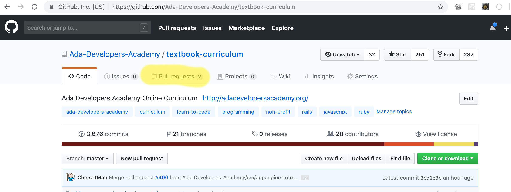
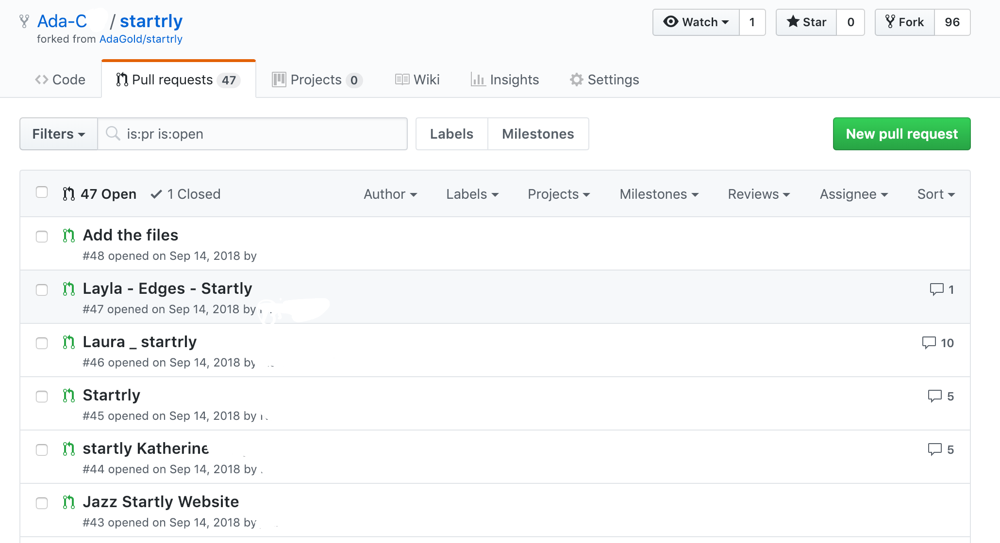
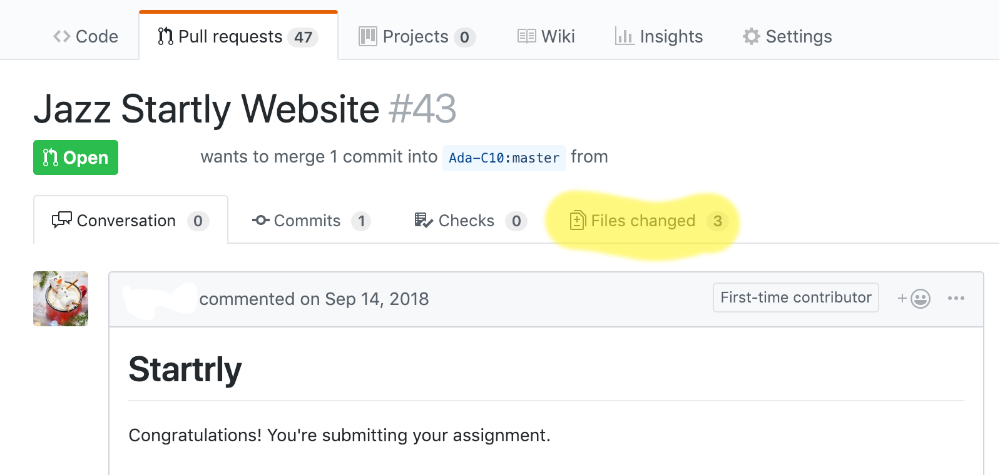
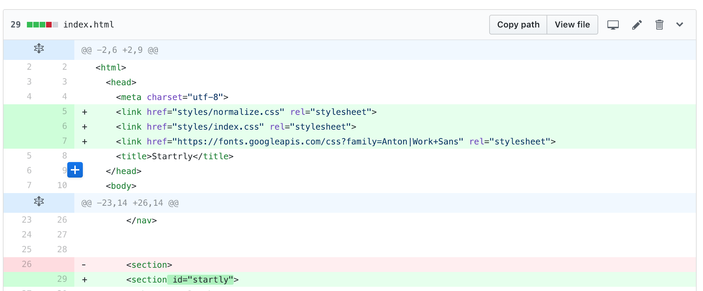
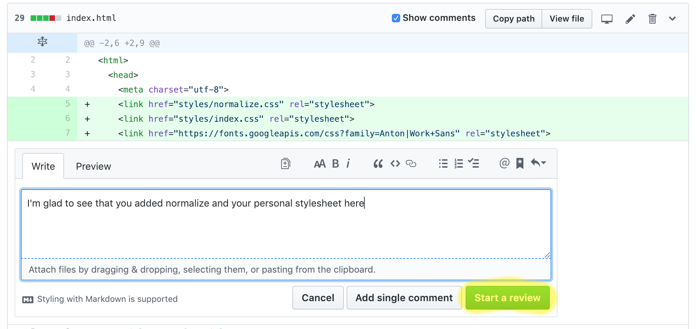
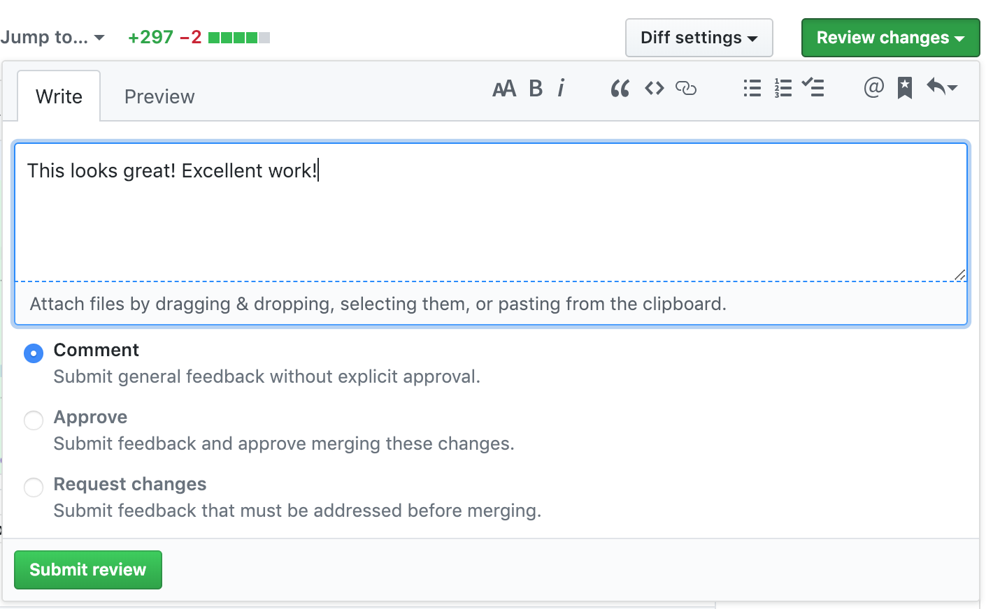

# Peer Review

## Introduction

When you start working in industry, whether for a large company or a small start-up, there is a pretty good chance that at some point you will be asked to review code written by your peers before it is pushed to your codebase. 

There are a lot of good reasons why this practice exists: it helps us reduce errors, build understanding of parts of the codebase that we don't regularly interact with, and developing trust among team members.

GitHub, as a version control platform, gives us quite a few tools to help with the process of doing a code review, including comments, pull requests, bug reports and approvals.

## Learning Goals

By the end of this activity, you will be able to
- Explain the value of doing peer code reviews
- Use GitHub's tools to engage with the code of your peers

## Getting Started

Whenever we ask you to turn in homework, we have you make a Pull Request, or PR. A PR is a way of asking for other contributors on the project to look at your code and check it for bugs or errors. If you navigate to the repository you cloned from and look at the top bar for the repo, you should see a button labeled Pull Request, see below. Click that button.

You should see a list of your fellow students pull requests. Find your partner's PR in the list of names, and open it up.

On your partner's page, you can see how they answered the comprehension questions, as well as how many commits the submitted and files they changed. Let's open the Files Changed Tab.

From here, we can hover over one of the line numbers on the left hand side to insert a comment. Clicking the blue backed plus sign that appears will open a comment dialog. 

Once you have filled in your first comment, you can click the button in the bottom right corner of the dialog labeled "Start A Review". Note that the the four lines above the comment will be visible in previews of the comment, so make sure that the relevant code is at least partially in that window.

 This button lets you have a handful of comments queued until you are ready to share them. Most users get email notifications when they receive comments, so this is a curtesy on your part, but it also can let you read the whole PR while adding and editing comments as you go. You might find a question that you pose in on comment no longer applies when you read further in the document, and can easily delete it before submitting your changes. When you have finished commenting, scroll pack to the top of page.

 

 In the top of the review pane, there is a button that says Review Changes. When you have opened that pane, there is a field to let you leave a comment summary. You may or may not have a lot to share here, and sometimes it's okay to leave this blank.

 Beneath the input field, there is a set of radio buttons labeled `Comment`, `Approve` and `Request Changes`. In the real world, these are the main way that you communicate a pass-or-fail state about the request! For this situation, Comment is the option that fits the best.

 When you've finished your selection, you will click Submit Review.

## Requirements

We want you to take about 25 minutes to review your partner's code.

It's important to highlight strengths in your partner's code, as well as anything that is difficult to understand or that is broken. When giving negative feedback it is also important to focus on what is wrong with the code: "This selector is targeting X instead of Y" is preferable to "You messed up this CSS". As such, your review needs to follow the conventions below:

- One or more things in the code that you admire, or want to learn how to do yourself
- One or more things that could be improved about the code
- Critical comments are framed to improve the quality of codes

Once you and your partner have finished commenting, please submit your review as comment only.
